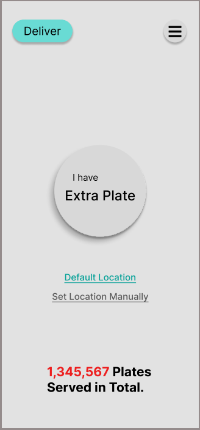
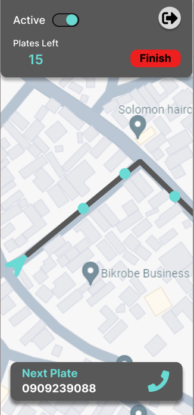

## How to Run

setup a python virtual environment and then run 'app.py' found in middleware/

make sure all necessary packages like flask and firebase-admin are installed

you can change the host address in app.py by changing the variable named 'host' to suit your needs;

the port is 5000

